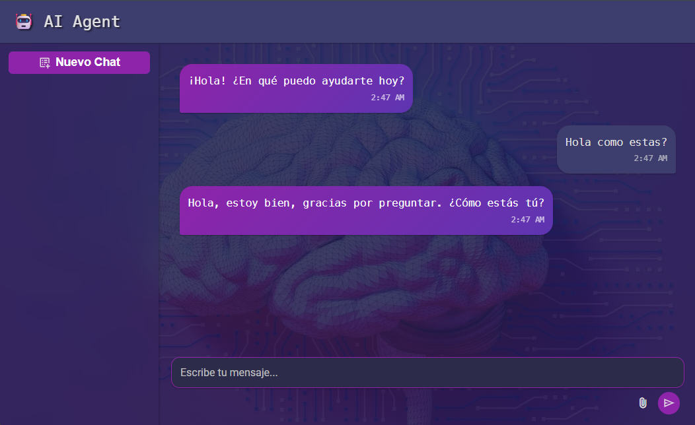

# 🚀 MindFlow AI: Tu Asistente Inteligente con Memoria y Búsqueda Web 🧠🌐

## ✨ ¡Bienvenido a MindFlow AI!

¿Cansado de los asistentes de IA que olvidan el contexto de tu conversación? ¿Necesitas respuestas actualizadas del mundo real al instante? **MindFlow AI** es la solución. Este proyecto es un asistente de inteligencia artificial avanzado, diseñado para ser tu copiloto definitivo, combinando una memoria conversacional persistente con la capacidad de buscar información en la web en tiempo real.

Impulsado por la velocidad y eficiencia de la infraestructura de Groq, y la potencia de búsqueda de Tavily, MindFlow AI no solo recuerda lo que le has dicho, sino que también puede buscar en la web para proporcionarte la información más precisa y actual, ¡todo en una interfaz de usuario limpia y moderna!

## 🌟 Características Destacadas

* **Memoria Conversacional Persistente:** Mantiene el contexto de tus conversaciones a través de múltiples sesiones, permitiendo interacciones más naturales y fluidas.
* **Búsqueda Web en Tiempo Real:** Utiliza la potente API de Tavily para acceder a información actualizada, garantizando respuestas precisas sobre eventos, datos y noticias recientes.
* **Interfaz de Usuario Intuitiva:** Una UI minimalista y moderna, diseñada para una experiencia de usuario sin distracciones.
* **Respuestas en Markdown:** Formatea las respuestas del modelo de lenguaje, incluyendo bloques de código, para una legibilidad óptima.
* **Optimizado con Groq:** Aprovecha la increíble velocidad de inferencia de los modelos de lenguaje de Groq para respuestas casi instantáneas.

## 📸 Un Vistazo a MindFlow AI

Aquí puedes ver cómo luce MindFlow AI en acción:

### Interfaz Principal del Chat

¡Comienza a conversar y observa cómo MindFlow AI te entiende y responde con precisión!


_Descripción: La interfaz principal del chat con mensajes de usuario y respuestas del asistente._


## 🛠️ Tecnologías Utilizadas

* **Frontend:**
    * HTML, CSS (con variables y diseño responsivo)
    * JavaScript (ES Modules para una arquitectura modular)
* **Backend:**
    * [**FastAPI**](https://fastapi.tiangolo.com/): Un framework web moderno y rápido para construir APIs con Python.
    * [**LangChain**](https://www.langchain.com/): Framework para desarrollar aplicaciones impulsadas por modelos de lenguaje.
    * [**Groq Python SDK**](https://console.groq.com/docs/api-reference): Integración con los modelos de IA de alta velocidad de Groq (ej. `llama-3.1-8b-instant`, `meta-llama/llama-4-scout-17b-16e-instruct`).
    * [**Tavily Search API**](https://tavily.com/): Herramienta de búsqueda web para el agente de IA.
    * `python-dotenv`: Para la gestión segura de variables de entorno.

## 🚀 ¡Pruébalo Tú Mismo! (Configuración Local)

Sigue estos pasos para poner en marcha MindFlow AI en tu máquina local:

### 1. Clona el Repositorio

```bash
https://github.com/JUANJO-MDG/AI-Agent.git
```

## 2.Configuración del Entorno Virtual y Dependencias

```bash

# Crear un entorno virtual
python -m venv .venv

# Activar el entorno virtual (Linux/macOS)
source .venv/bin/activate

# Activar el entorno virtual (Windows)
.venv\Scripts\activate

# Instalar las dependencias de Python
pip install -r requirements.txt
```

## 3. Configuración de Claves API

```bash
GROQ_API_KEY="tu_clave_api_de_groq_aqui"
TAVILY_API_KEY="tu_clave_api_de_tavily_aqui"
```

## 4. Iniciar el Servidor Backend

```bash
uvicorn main:app --reload --port 8000
```
